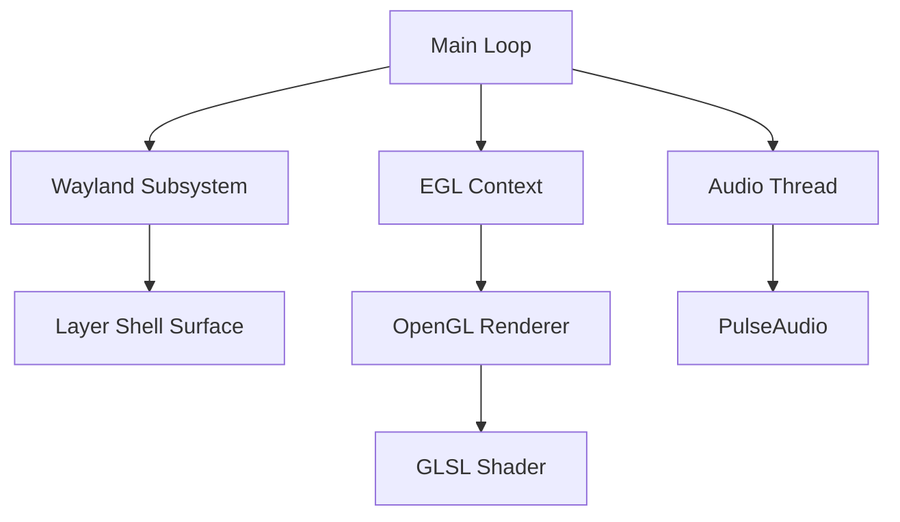

# Architecture Overview

<!-- Context Type: Architecture & Design -->
<!-- Scope: High-level design, data flow pipelines, and critical system boundaries. -->

## Table of Contents
- [1. High-Level Design](#1-high-level-design)
- [2. Subsystems](#2-subsystems)
- [3. Data Flow](#3-data-flow)

## 1. High-Level Design

GLWall is a C application that bridges Wayland (for display) and OpenGL (for rendering).

## 2. Subsystems

### 2.1. Main Loop (`main.c`)
*   Initializes state.
*   Runs the Wayland event loop (`wl_display_dispatch`).
*   Rendering is event-driven, triggered by `wl_callback` (frame callbacks) to sync with monitor refresh rate.

### 2.2. Wayland (`wayland.c`)
*   Connects to the compositor.
*   Binds to globals: `wl_compositor`, `wl_shm`, `zwlr_layer_shell_v1`.
*   Creates a layer surface attached to the background layer (`ZWLR_LAYER_SHELL_V1_LAYER_BACKGROUND`).

### 2.3. Rendering (`opengl.c`, `egl.c`)
*   **EGL**: Creates a context on the Wayland surface.
*   **OpenGL**: Compiles shaders, sets up VBOs/VAOs, and executes draw calls.
*   **Uniforms**: Updates `u_time`, `u_resolution`, `u_mouse`, and `u_audio_spectrum` every frame.

### 2.4. Audio (`audio.c`)
*   Runs in a separate thread to avoid blocking the render loop.
*   Captures audio via PulseAudio Simple API.
*   Performs FFT (Fast Fourier Transform) to generate frequency data.
*   Writes to a shared ring buffer that the render thread reads from to update the audio texture.

### 2.5. Input (`input.c`)
*   **Kernel Input**: Uses `libevdev` to read directly from `/dev/input/event*` devices.
*   **Device Discovery**: Scans for pointer devices, prioritizing relative mice over touchpads.
*   **Hyprland IPC**: Connects to Hyprland's IPC socket to fetch cursor position (if available).
*   **Integration**: Updates `state->pointer_x` and `state->pointer_y` independently of Wayland focus.

## 3. Data Flow

1.  **Input**: 
    *   **Wayland**: Mouse events when surface has focus.
    *   **Kernel/IPC**: Global mouse tracking when `--kernel-input` is enabled.
    *   **Audio**: PulseAudio data processed via FFT.
2.  **Update**: On frame callback, the render loop reads the current state.
3.  **Render**: Uniforms are uploaded to the GPU.
4.  **Display**: `eglSwapBuffers` presents the new frame to the compositor.
